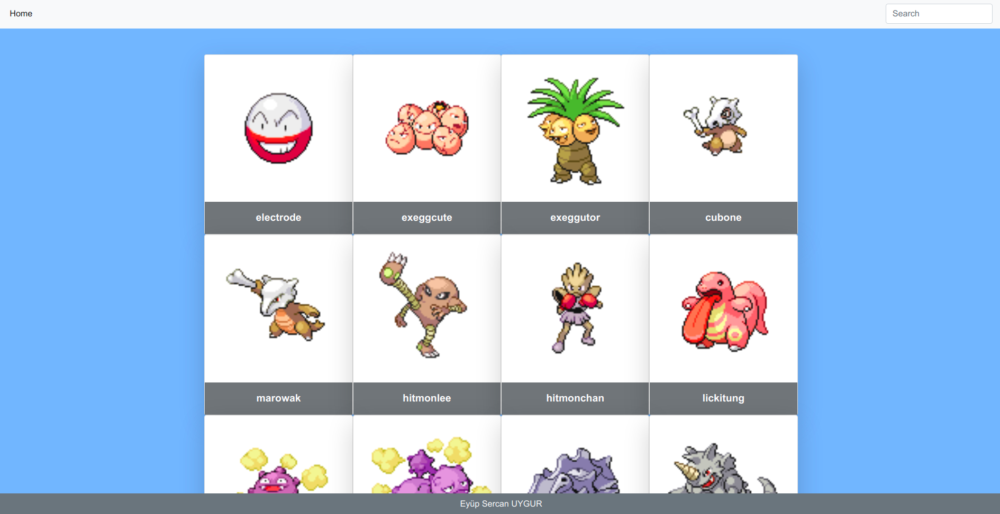

# The-Pokemon-App

This is the Capstone project at Microverse which uses the [poke-api](https://pokeapi.co/). The app fetches the pokemons 100 perpage and you can see more details of the pokemon if you'd like to. This is a "Catalogue of Recipes" based project.

<br>

## Built With

- Javascript
- React
- Redux
- Eslint
- Stylelint
- Yarn

## Prerequisities

To get this project up and running locally, you must have node installed on your local machine.

## Live Link

Here is the live [link](https://pokemon-app-sercan.herokuapp.com/)

## Getting Started

**Setup**

- Clone this repository with ```git clone git@github.com:eypsrcnuygr/pokemon-app.git``` using your terminal or command line.<br>
- Change to the project directory by entering ```cd pokemon-app``` in the terminal<br>
- Next run ```yarn``` to install the necessary dependencies<br>
- Run ```yarn start``` to have the necessary changes applied if you want to change anything in the codebase.<br>
- The command above will run the local server.<br>
- Wait for bundle to finish.<br>
- Enjoy!<br>

**Repository Content**

- The src folder contains components, helpers and for Redux; actions, reducers and store folders. There is also a tests folder, which has 2 files in it.
It checks the succesfull API call and control the UI based on a mock store for the App component and Pokemon component.
- To run tests in the app folder run ```yarn test```.

## Authors

👤 **Eyüp Sercan UYGUR**

-   Github: [@eypsrcnuygr](https://github.com/eypsrcnuygr)
-   Twitter: [@eypsrcnuygr](https://twitter.com/eypsrcnuygr)
-   LinkedIn: [eypsrcnuygr](https://www.linkedin.com/in/eypsrcnuygr/)
-   Email: [Eyüp Sercan UYGUR](sercanuygur@gmail.com)


## 🤝 Contributing

Contributions, issues and feature requests are welcome!

## Show your support

Give a ⭐️ if you like this project!

## Acknowledgments

-   This Project was part of an assignment of Microverse.
-   Our thanks to Microverse and all our peers and colleagues there.

## 📝 License

This project is [MIT](https://github.com/git/git-scm.com/blob/master/MIT-LICENSE.txt) licensed.
